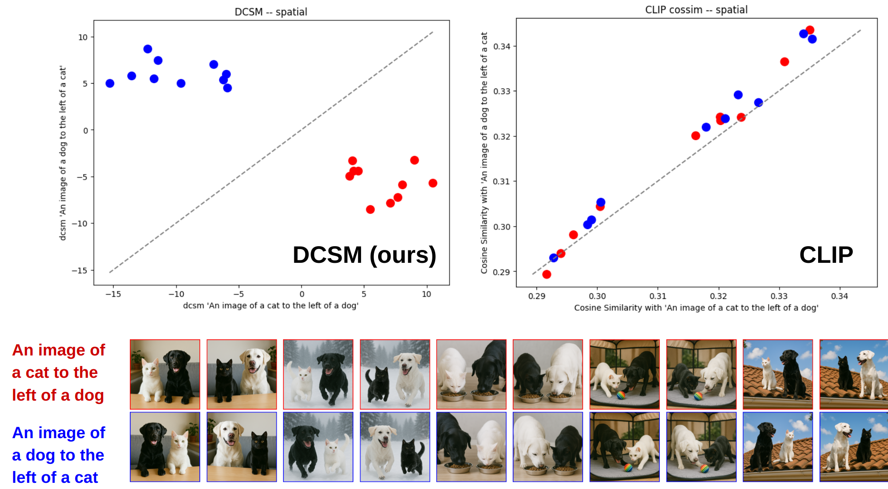
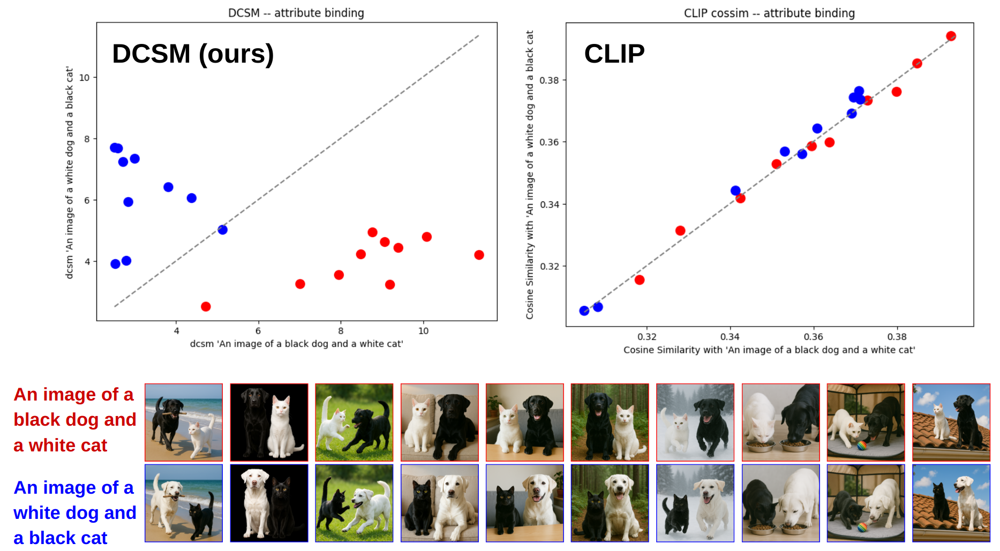
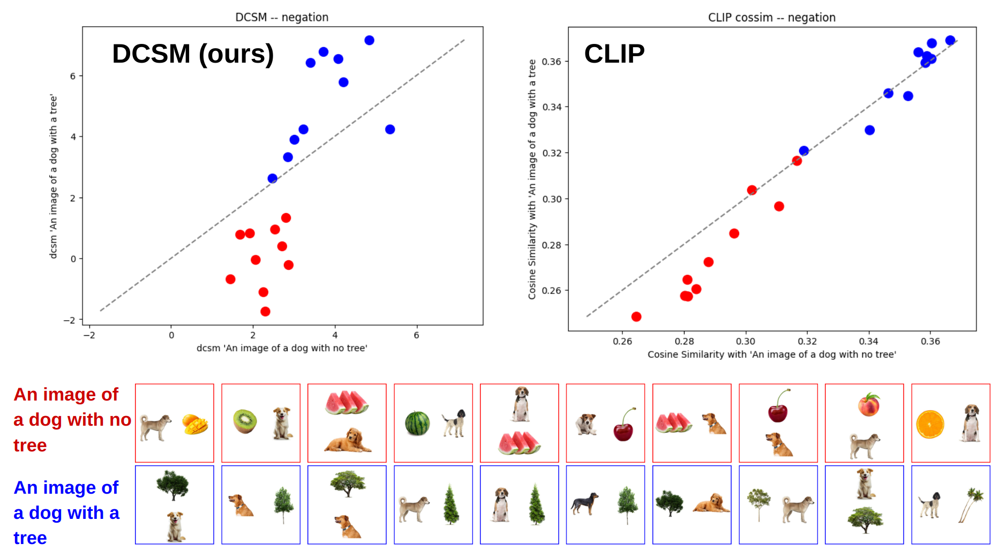

# Ideal-CLIP-DCSM

This repository contains the implementation for the paper **["Is CLIP ideal? No. Can we fix it? Yes!"](https://arxiv.org/abs/2503.08723) (ICCV 2025).** In our work, we perform formal logical analyses on the geometry of the CLIP latent space to find fundamental limitations in representing attribute binding, spatial relationships/localization, and negation. We then introduce Dense Cosine Similarity Maps (DCSMs) and propose to train a lightweight downstream scoring network which improves upon CLIP's shortcomings. This repository contains the code to train a CNN for scoring DCSMs, as well as evaluation code for tranied models and static models like CLIP, NegCLIP, SigLIP, Coca, and BLIP.

### Preview of DCSM vs. CLIP in Spatial Understanding

### Attribute Binding

### Negation



<!-- ## Dependencies

The project uses several key dependencies:
- **PyTorch**: For deep learning framework
- **Transformers**: For CLIP models and tokenizers
- **OpenAI CLIP**: For baseline CLIP models
- **Open-CLIP**: For alternative CLIP implementations
- **Salesforce LAVIS**: For additional vision-language models
- **Objaverse**: For 3D object dataset access -->

## Installation

Clone the repository:
```bash
git clone <DCSM_Ideal_CLIP>
cd DCSM_Ideal_CLIP
```

Then install the required packages:
```bash
pip install -r requirements.txt
```

## Project Structure

```
Ideal-CLIP-DCSM-private/
├── src/
│   ├── training/
│   │   ├── main.py          
│   │   ├── train.py         
│   │   ├── training_util.py 
│   │   └── toydataset_dense.py 
│   ├── evaluating/
│   │   ├── main.py          
│   │   └── run_evals.py     
│   └── util/               
├── whatsup_vlms/           
├── data/                 #currently contains img assets, but add training data here.                 
├── pretrained_models/    # add checkpoints for eval here
└── notebooks/             
```
Note that whatsup_vlms is from ["What's Up with Vision Language Models?"](https://github.com/amitakamath/whatsup_vlms) (EMNLP 2023) by Kamath et. al. We used datatsets and helper functions from this work as evaluation sets for our models.

## Data

Populate ```data``` with the training data found at [this Google Drive link](https://drive.google.com/drive/folders/1W5KNbdWM1vSMg7TYqf1RRvcL_uhZPbUP?usp=sharing).
Note that make_and_return_training_data.py in src/training/training_util.py natively combines training images and captions for all 3 of CLIP's failure modes. You can mix and match them by specifying certain datasets.

For evaluation, also add ```val2017``` from [COCO](https://cocodataset.org/#download), the CVLEVR-bind dataset from [this github repository](https://github.com/marthaflinderslewis/clip-binding), the datasets necessary for NegBench from [this github repository](https://github.com/m1k2zoo/negbench/blob/main/datasets.md), and the composite NCD dataset from [this Google Drive link](https://drive.google.com/drive/folders/1OohHr8L1YcEYpIEDQKP-HMQsNcXdj71_?usp=drive_link).

## Model Checkpoints

Download the synthetic and COCO-trained models at [this Google Drive link](https://drive.google.com/drive/folders/1HngVf3BixeRnpa0kEuCx5nucGFrQ3Dv6?usp=sharing) to populate ```pretrained_models```.

## Usage

### Training

To train the model with dense cross-modal supervision, use:

```bash
python src/training/main.py \
    --data_path /path/to/your/data \
    --model_save_path /path/to/save/models \
    --batch_size somenumber \
    --learning_rate 1e-5 \
    --num_epochs somenumber \
    --device cuda
```
By default, make_and_return_train_data loads all training data. Modify the function to limit training.

### Evaluation

To evaluate the trained model on various benchmarks, use:

```bash
python src/evaluating/main.py \
    --model_path /path/to/your/model.pth \
    --model_name ModelName
    --root_dir /path/to/evaluation/data \
    --output_path /path/to/save/results \
    --device cuda
```

Alternatively, set model_name to "all" and modify the list of models to test in ```main.py```.
By default, get_test_dataloaders loads all datasets. Modify the function to evaluate on a select few.


## Datasets

The project currenty contains support for evaluating on [CLEVR-bind](https://github.com/marthaflinderslewis/clip-binding), [Natural Colors Dataset](https://github.com/saeed-anwar/ColorSurvey), [VG-Attribution](https://github.com/mertyg/vision-language-models-are-bows), [WhatsUp](https://github.com/amitakamath/whatsup_vlms), [COCO-spatial](https://github.com/amitakamath/whatsup_vlms), [VG-Spatial](https://github.com/amitakamath/whatsup_vlms), and [NegBench](https://github.com/m1k2zoo/negbench/tree/main).


## Citation

If you find this useful, please consider citing our work!

<!-- ```bibtex
@inproceedings{ideal_clip_2025,
  title={Is CLIP Ideal? No. Can We Fix it? Yes!},
  author={Kang, Raphaela and Song, Yue and Gkioxari, Georgia and Perona, Pietro},
  booktitle={International Conference on Computer Vision (ICCV)},
  year={2025},
  organization={IEEE}
}
``` -->

```bibtex
@article{kang2025clip,
  title={Is CLIP ideal? No. Can we fix it? Yes!},
  author={Kang, Raphi and Song, Yue and Gkioxari, Georgia and Perona, Pietro},
  journal={ICCV},
  year={2025}
}
```
